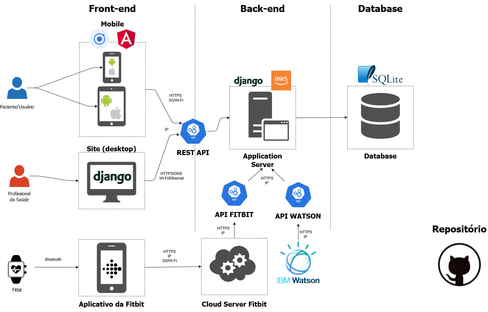

# projeto-asma
Projeto do Laboratório de Engenharia de Software da Poli-USP em parceria com a Faculdade de Medicina da USP e o Hospital das Clínicas.

## Apps
Cada aplicação tem o próprio README.md, que engloba todas as instruções de execução da aplicação:
- O app ```app_asma``` é nosso aplicativo mobile, que consiste em toda a interface do paciente com o nosso sistema.
- O app ```django_server``` funciona como o nosso servidor. Ele consiste na API rest, banco de dados e todo o front end para os profissionais de saúde.

## Arquitetura
A arquitetura do projeto é apresentada à seguir:
